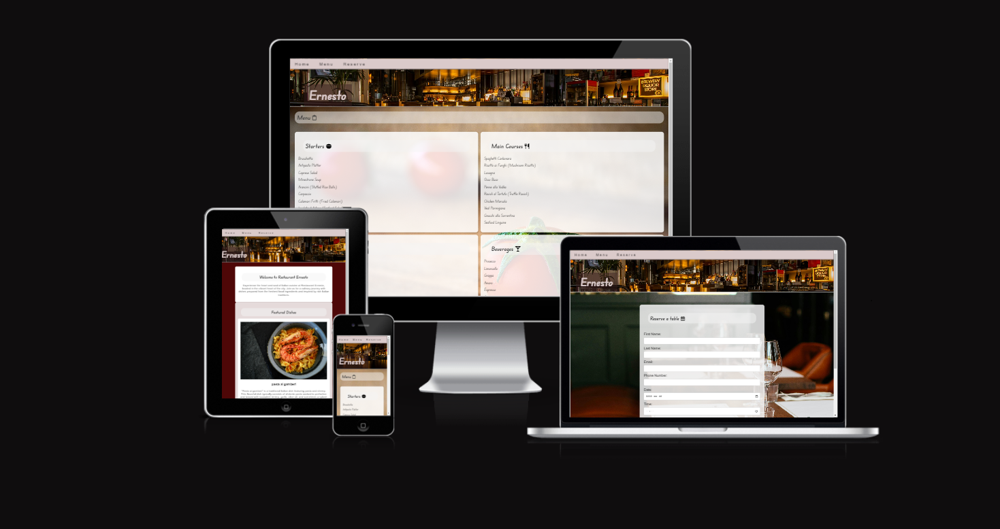
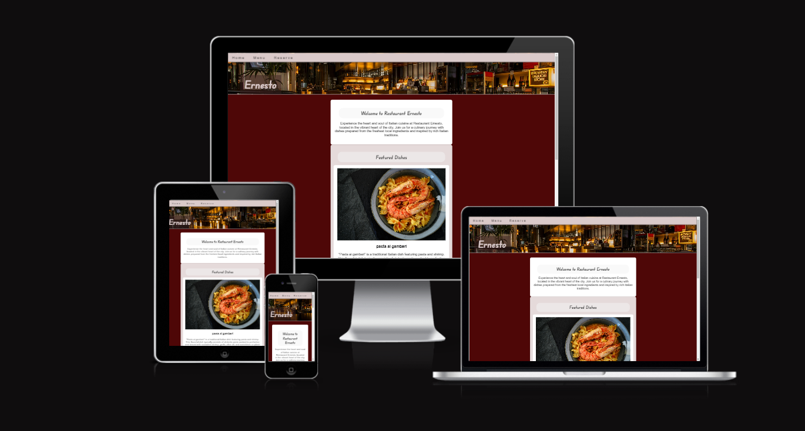
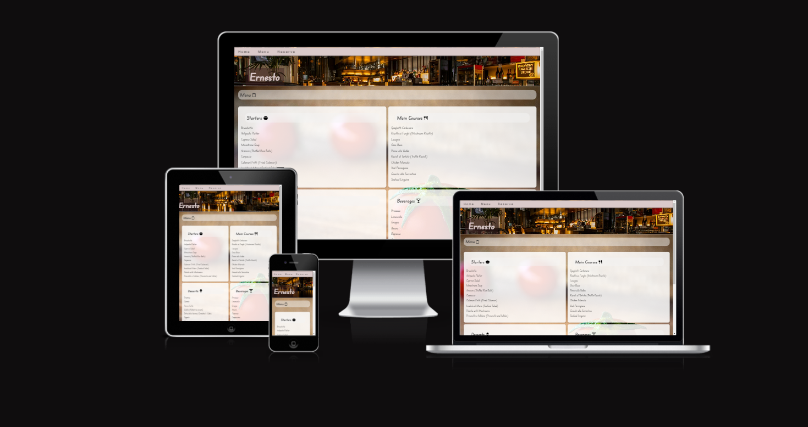
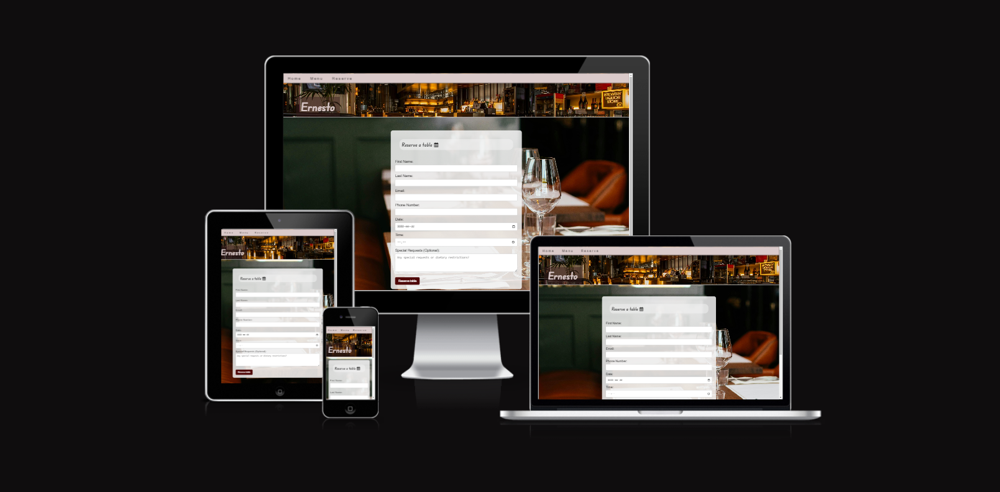

# Restaurant Ernesto

- [Restaurant Ernesto](#restaurant-ernesto)
  * [Introduction & Overview](#introduction---overview)
  * [Website Structure and Development Details](#website-structure-and-development-details)
  * [Testing](#testing)
    + [Overview](#overview)
    + [Feature Testing](#feature-testing)
    + [Browser Compatibility](#browser-compatibility)
    + [Responsiveness](#responsiveness)
    + [Validator Testing](#validator-testing)
    + [Unfixed Bugs](#unfixed-bugs)
    + [Handling 404 Errors](#handling-404-errors)
  * [Technologies Used](#technologies-used)
    + [Tools and Resources](#tools-and-resources)
  * [Deployment](#deployment)
    + [Github Pages](#github-pages)
  * [Local Development Setup](#local-development-setup)
    + [Introduction](#introduction)
    + [Why Visual Studio Code and WSL?](#why-visual-studio-code-and-wsl-)
    + [Prerequisites](#prerequisites)
    + [Setting Up the Environment](#setting-up-the-environment)
  * [Credits](#credits)
    + [Code Insights and Inspiration](#code-insights-and-inspiration)
    + [Content](#content)
    + [Media](#media)
    + [Acknowledgements](#acknowledgements)

<small><i><a href='http://ecotrust-canada.github.io/markdown-toc/'>Table of contents generated with markdown-toc</a></i></small>

## Introduction & Overview 

Restaurant Ernesto is a website consisting of three main pages. Each page serves a specific function, providing information about the fictional restaurant and its offerings.

Home Page: This page introduces the restaurant with a concise description, including a section about the restaurant, its address, and reviews from guests and a critic. A 'Featured Dish' is also displayed, showcasing one of the restaurant's notable offerings.

Menu Page: The menu is detailed on this page, organized into categories: starters, main courses, drinks, and desserts. Each category lists the items available within it, offering a view of the restaurant's culinary options.

Reserve Page: On this page, visitors find a form to reserve a table. The form allows for the input of date, time, and special requests, facilitating the reservation process for potential guests.

The website is designed for accessibility and ease of use across different devices, ensuring information is readily available regardless of how the site is accessed.

## Website Structure and Development Details

This project's website consists of several key pages, each serving a distinct purpose to enhance the user experience and provide valuable information about Restaurant Ernesto:

- **Home Page (`index.html`)**: Introduces visitors to Restaurant Ernesto, featuring a welcome message, our featured dish, and customer reviews.

- **Menu Page (`menu.html`)**: Showcases our wide range of culinary offerings, including starters, main courses, drinks, and desserts.

- **Reserve Page (`form.html`)**: Contains a reservation form allowing visitors to book a table at our restaurant.

##  Testing

### Overview

Rigorous testing has been conducted to ensure that Restaurant Ernesto's website operates effectively across a broad spectrum of devices and browsers. This comprehensive testing approach aimed to validate that all features function as intended, thus offering users an intuitive and hassle-free experience to accomplish their objectives.

### Feature Testing

Each feature of the website, including the navigation bar, reservation form, and menu display, has been meticulously tested to verify its functionality. Here's a summary of the key features and the testing outcomes:

- Navigation Bar: Ensures seamless navigation across different pages of the website. Tested on multiple devices and browsers to confirm its responsiveness and functionality.

- Reservation Form: Allows users to easily reserve a table. Validation checks for required fields were tested to ensure accurate data collection.

- Menu Display: Showcases the restaurant's offerings. Tested for proper display of items across devices, ensuring readability and accessibility.

### Browser Compatibility

The website was tested on several major browsers, including Chrome, Firefox, Safari, and Edge, to ensure compatibility and performance consistency. No significant issues were observed across these platforms.

### Responsiveness

Responsiveness testing was carried out using Chrome DevTools to simulate various screen sizes, from large desktop monitors to smaller mobile screens. The website's design and layout adapted well across all tested screen sizes, maintaining usability and aesthetic appeal.

### Validator Testing

- HTML: The website's HTML code was validated using the W3C Markup Validation Service, which returned no errors, confirming adherence to web standards.

- CSS: The CSS code was validated with the W3C CSS Validation Service (Jigsaw), which also reported no errors, ensuring that the styling follows best practices.

### Unfixed Bugs

After thorough testing across multiple devices, browsers, and screen sizes, no unresolved bugs have been identified.

### Handling 404 Errors

To ensure a smooth user experience even when encountering broken or non-existent links, we've implemented a custom 404 page (`404.html`). This page informs users that the content they are looking for cannot be found and provides links back to the main sections of the website. There's no need to modify any code on the existing pages for the custom 404 page to work. Once `404.html` is placed in the root directory of the GitHub repository, GitHub Pages automatically detects and serves this page for any unresolved URLs.

This approach helps maintain user engagement by guiding them back to the website's core content and encourages further exploration rather than leaving them at a dead end.

For more technical details and insights into the development process, please refer to the [GitHub Pages documentation](https://docs.github.com/en/pages).

## Technologies Used

- [HTML5](https://en.wikipedia.org/wiki/HTML5)

- [CSS3](https://en.wikipedia.org/wiki/CSS)

- [JavaScript](https://en.wikipedia.org/wiki/javascript) 

### Tools and Resources

- [Git](https://git-scm.com/): Employed for version control, enabling regular commits to Git and updates to GitHub from the terminal in Gitpod.

- [GitHub](https://github.com/): Hosts the repository containing the project's code. GitHub Pages also hosts the live version of the website.

- [Pixels](https://www.pexels.com/sv-se/): Provided royalty-free images and videos, enhancing the visual content of the contact page.

- [W3C Validation](https://www.w3.org/): Used to ensure the website's HTML and CSS adhere to industry standards and best practices.

- [Visual Studio Code](https://code.visualstudio.com/): The code editor of choice for developing the website, offering powerful coding and debugging tools.

- [OpenAI's ChatGPT](https://openai.com/): Assisted in validating code, checking spelling, translation and offering coding advice to refine the website's content and functionality.

- [Font Awesome](https://fontawesome.com/): Supplied the vector icons integrated throughout the website.

- [Google Fonts](https://fonts.google.com/): The source of all custom typography on the website, enhancing the user interface's aesthetics.

- [Chrome DevTools](https://developer.chrome.com/docs/devtools/): An indispensable suite of web development tools used extensively in the website's development process.

- [Windows Subsystem for Linux (WSL)](https://docs.microsoft.com/en-us/windows/wsl/): Enabled the use of Linux tools on Windows, such as running a local development server through Python's HTTP server module by executing `python -m http.server`.

## Deployment
### Github Pages

The website for Restaurant Ernesto is hosted on GitHub Pages. The steps to deploy a repository on GitHub Pages are as follows:

1. Ensure that your project has an `index.html` file at the root level. GitHub Pages looks for this file to serve as the entry point for the website.

2. Log in to GitHub and navigate to your repository. In this case, the repository is located at [Ernesto](https://github.com/Darvid-223/ernesto/).

3. Once in the repository, click on the 'Settings' tab, which is towards the top of the page.

4. Scroll down to the 'GitHub Pages' section.

5. Under 'Source', click on the dropdown menu and select the branch you want to deploy. If you're deploying from the master/main branch and your project doesn't use a build process, choose 'master/main'. If your project requires a build step, you might need to select a 'gh-pages' branch or a `/docs` folder.

6. After selecting the branch, the page will automatically refresh, and GitHub will begin the deployment process.

7. Once deployed, GitHub will provide you with a link to the live site. For the Restaurant Ernesto project, the live site can be found at [https://darvid-223.github.io/ernesto/](https://darvid-223.github.io/ernesto/).

Remember that it might take a few minutes for the changes to go live. If you make further updates to your project, those changes will be automatically deployed to your GitHub Pages site upon push to the selected branch.

For additional settings like custom domains, refer to the [GitHub Pages documentation](https://docs.github.com/en/github/working-with-github-pages).

## Local Development Setup

### Introduction

While the course recommends using Codeanywhere as a cloud-based development environment, for this project, I opted to use Visual Studio Code installed locally on my Windows computer. My familiarity with Visual Studio Code and its immediate responsiveness compared to the process of setting up and loading Codeanywhere each time greatly influenced this choice.

### Why Visual Studio Code and WSL?

Visual Studio Code is a powerful and versatile code editor that supports a wide range of programming languages and frameworks. Its extensive library of extensions makes it highly customizable, fitting perfectly into my workflow. Furthermore, by leveraging the Windows Subsystem for Linux (WSL), I was able to create a Linux-like development environment on Windows. This setup allowed me to use Linux commands and tools directly in Windows, offering the best of both worlds for web development.

Choosing Visual Studio Code and WSL over Codeanywhere was a strategic decision to optimize my development process, capitalizing on speed and efficiency without sacrificing the versatility and power needed for complex web development tasks.

### Prerequisites

To replicate this local development environment, I installed the following programs to my system:

- Visual Studio Code as my primary code editor.
- Windows Subsystem for Linux (WSL) for a Linux-compatible terminal and development environment on Windows.
- Git for version control and cloning the project repository.

### Setting Up the Environment

1. Install WSL: Follow the instructions provided by Microsoft to install WSL on your Windows machine. Choose a Linux distribution of your preference from the Microsoft Store (Ubuntu is a popular choice).

2. Install Visual Studio Code: Download and install Visual Studio Code from the official website. Once installed, enhance your setup with extensions like Live Server for real-time page reloading and the WSL extension to integrate your Linux environment seamlessly.

3. Clone the Repository: Open VS Code's integrated terminal, switch to your WSL environment, and clone the Restaurant Ernesto repository using Git:
git clone https://github.com/Darvid-223/ernesto.git
cd ernesto

4. Run the Project Locally: With the repository cloned to your local machine, you can start a simple HTTP server to serve the project files. If you have Python installed in your WSL environment, you can use it to start a server:
python -m http.server

## Credits

### Code Insights and Inspiration

- Numerous challenges were surmounted with insights from the collaborative community at [Stack Overflow](https://stackoverflow.com/).

- The tutorials and resources at [W3Schools](https://www.w3schools.com/) proved to be valuable for learning and experimentation with new web development techniques.

- The Code Institute's "Love Running" project served as a structural template.

- Guidance from [OpenAI's ChatGPT](https://openai.com/) was instrumental in refining the code and troubleshooting issues, providing conversational support akin to a virtual mentor.

- Additional learning resources such as [CSS-Tricks](https://css-tricks.com/).

### Content

- The typefaces used throughout the website are courtesy of [Google Fonts](https://fonts.google.com/).

- The narrative and descriptive content presented across the site were crafted by me, drawing inspiration from contributions by other students.

### Media

- The icons utilized on the website were sourced from [Font Awesome](https://fontawesome.com/).

- All visual elements, including images and videos, were sourced from Pixabay. Each image or video source is duly credited in the code, accompanied by links to the respective sources.

### Acknowledgements

- My mentor, Sheryl Goldberg, provided invaluable feedback and insightful suggestions for enhancing the project along the way.

- My friend Lucas Behrendt also provided me with feedback and tips from his experience in the same course.

